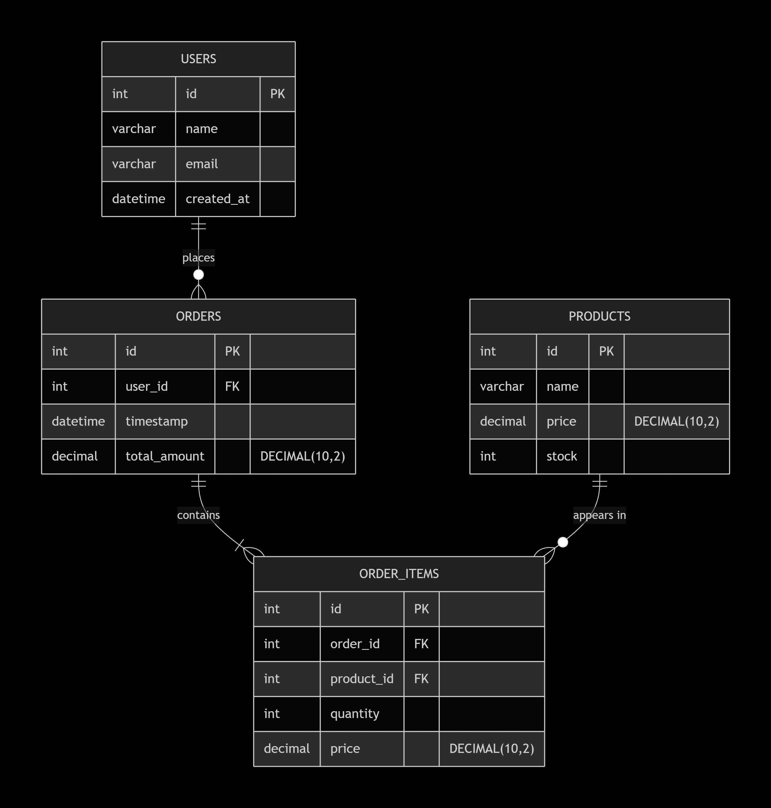

# E-Commerce Database SQL Project

## Project Overview
This project is an **E-Commerce Database SQL implementation** developed as part of the  
**M605 – Database Systems / SQL** academic module.

The project demonstrates the design, creation, and querying of a relational database using **MySQL** to support a basic e-commerce system.

The database design is based on core e-commerce entities such as users, products, orders, and order items.  
SQL scripts are provided to create the schema, insert sample data, and execute advanced SQL queries.

---

## Objectives
- Design a relational database using SQL
- Implement primary keys and foreign key relationships
- Populate tables with sample data
- Write meaningful SQL queries for data retrieval and analysis
- Visualise the database design using an ER diagram

---

## Technologies Used
- **Database:** MySQL  
- **Query Language:** SQL  
- **Design Tool:** ER Diagram (PNG)  
- **Version Control:** Git & GitHub  

---

## Project Structure

```
GISMA_DB_SQL_project/
│
├── 01_sql_schema_and_data.sql
├── 02_sql_queries.sql
│
├── diagrams/
│   └── ER.png
│
└── README.md
```

---

## How to Clone This Repository

### Using HTTPS
```bash
git clone https://github.com/Arun-Singh-Chauhan-09/GISMA_DB_SQL_project.git
```

### Using SSH
```bash
git clone git@github.com:Arun-Singh-Chauhan-09/GISMA_DB_SQL_project.git
```

After cloning:
```bash
cd GISMA_DB_SQL_project
```

---

## How to Run the SQL Project

1. Open **MySQL Workbench** or MySQL CLI  
2. Create and select the database:
```sql
CREATE DATABASE ecommerce_db;
USE ecommerce_db;
```
3. Run schema and data:
```sql
SOURCE 01_sql_schema_and_data.sql;
```
4. Run queries:
```sql
SOURCE 02_sql_queries.sql;
```

---

## Database Schema

- **users**
- **products**
- **orders**
- **order_items**

### Relationships
- One user → many orders  
- One order → many order items  
- One product → many order items  

---

## ER Diagram



---

## SQL Queries
Demonstrates joins, filtering, aggregation, and analysis.

---

## Author
**Arun Singh Chauhan**  
MEng Computer Science  
Student Number: GH1052389  

---

## Academic Declaration
This project is submitted as part of an academic assessment.  
All work presented is original and created solely for educational purposes.
